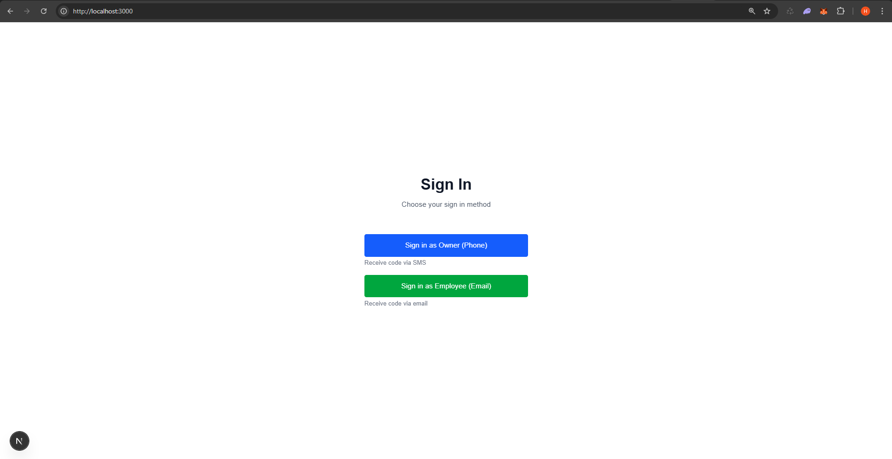
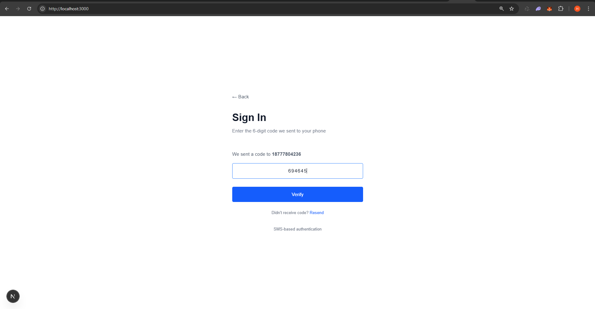
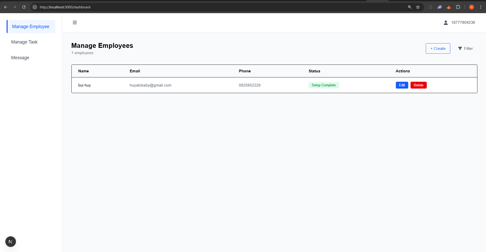
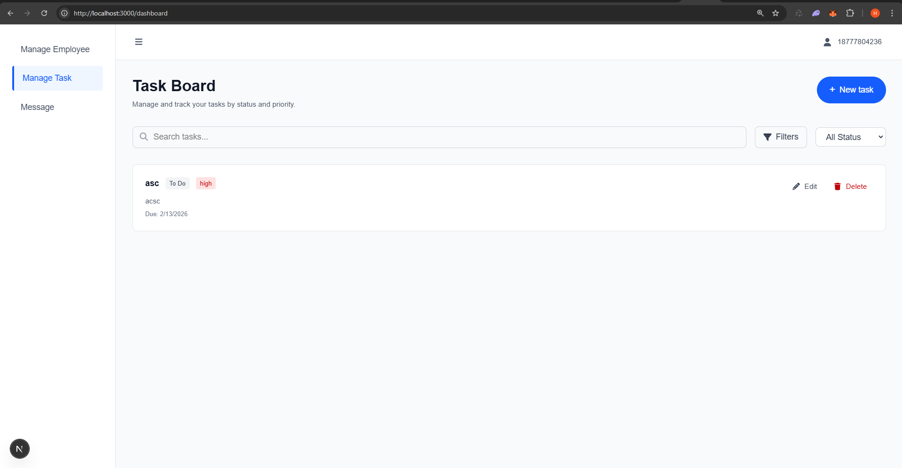
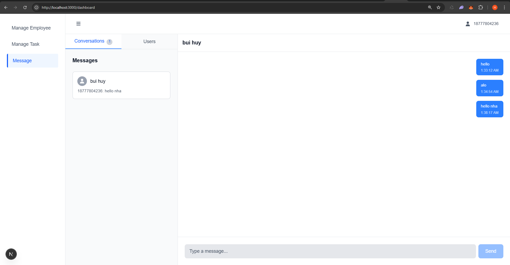
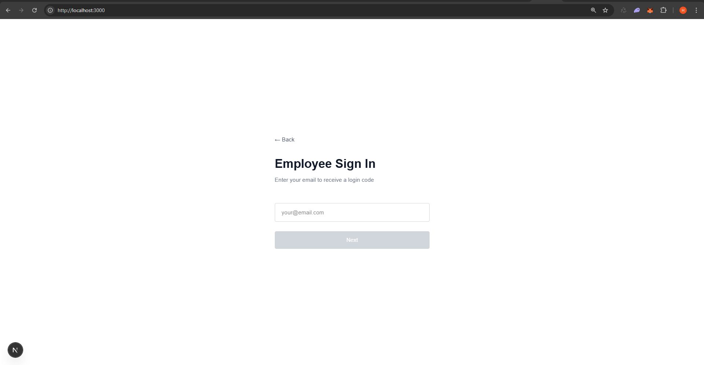
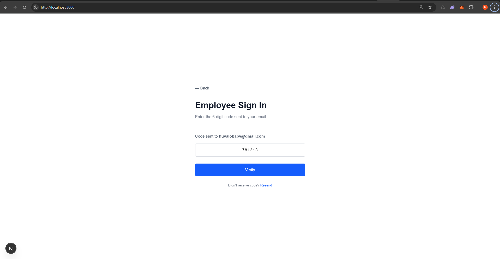
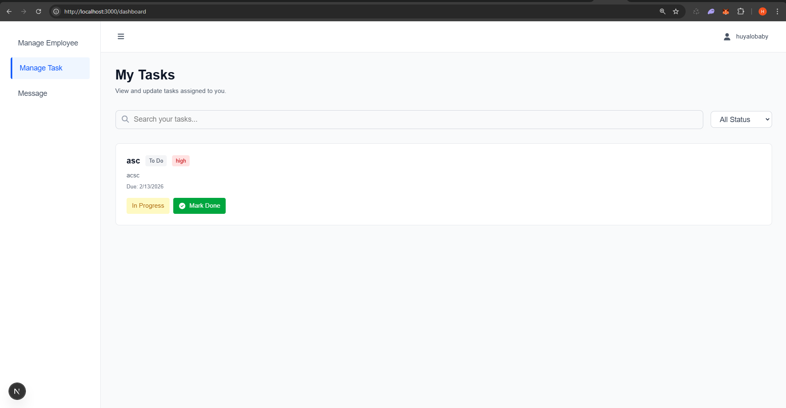
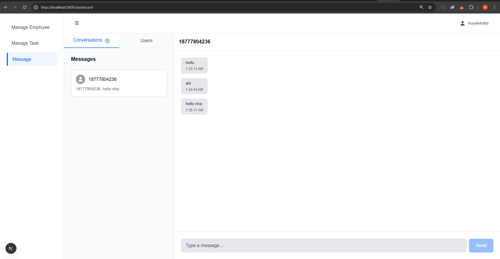

# Employee Task Management System

A full-stack application for managing employee tasks, assignments, and team communication in real-time. Built with Node.js and Next.js, this system helps organize workflows and keep teams connected through integrated messaging and notifications.

## What's Inside

### Backend (`/backend`)

The Express.js server handles all the heavy lifting:

- **Authentication**: JWT-based auth for both employees and owners
- **Real-time Chat**: Socket.io integration for instant messaging between team members
- **Task Management**: Create, update, assign, and track tasks
- **Email & SMS Notifications**: Automated updates via Nodemailer and Twilio
- **Firebase Integration**: Cloud storage and database management

**Key files you'll find:**

- `server.js` - Main server entry point
- `controllers/` - Business logic for tasks, messages, employees, etc.
- `routes/` - API endpoints
- `middlewares/` - Authentication and validation
- `collectionTypes/` - Data schemas (Employee, Task, Message, Conversation, Owner)
- `config/` - Firebase, Nodemailer, and Twilio setup

### Frontend (`/frontend`)

A modern Next.js + React application with TypeScript and Tailwind CSS:

- **Dashboard**: Overview of tasks and assignments
- **Task Board**: Visual task management interface
- **Employee Management**: CRUD operations for employee data
- **Messaging**: Real-time chat system
- **Setup Page**: Initial configuration

**Key files you'll find:**

- `app/` - Next.js app router and pages
- `components/` - Reusable React components
- `services/` - API and Socket.io client utilities
- `context/` - React context for auth, socket, and layout state

## Getting Started

### Prerequisites

- Node.js (v14+ recommended)
- npm or yarn
- Firebase credentials (generate a json file from https://console.firebase.google.com/u/0/project/your-project-id/settings/serviceaccounts then place it in `backend/` directory and name it serviceAccountKey.json)

### Setup

**1. Clone and install dependencies:**

```bash
# Backend
cd backend
npm install

# Frontend
cd frontend
npm install
```

**2. Configure the backend:**

- Add a `.env` file in the `backend/` directory with your configuration like `.env.example`

- Place your Firebase `serviceAccountKey.json` in the `backend/` directory

**3. Configure the frontend:**

- Create a `.env.local` file in the `frontend/` directory:

```
NEXT_PUBLIC_API_URL=http://localhost:5000
```

### Running the Project

**Start the backend server:**

```bash
cd backend
npm start          # Production mode
# or
npm run dev        # Development mode with auto-reload via nodemon
```

Server will be available at `http://localhost:5000`

**Start the frontend:**

```bash
cd frontend
npm run dev        # Development mode
# or
npm run build && npm start   # Production mode
```

Frontend will be available at `http://localhost:3000` (or next available port)

**Both should be running simultaneously** for the full application to work.

## Project Structure at a Glance

```
backend/
├── controllers/     # API logic and request handlers
├── routes/          # Express route definitions
├── middlewares/     # Auth and validation middleware
├── collectionTypes/ # MongoDB collection schemas
├── config/          # Firebase, Email, SMS configs
├── socket/          # Socket.io real-time features
├── utils/           # Helper functions (auth, email, etc)
└── server.js        # Entry point

frontend/
├── app/             # Next.js pages and layout
├── components/      # Reusable UI components
├── services/        # API and Socket.io clients
├── context/         # React context providers
├── utils/           # Helper functions
└── public/          # Static assets
```

## Key Features

- **Employee Management** - Create and manage employee profiles
- **Task Board** - Organize tasks with visual status tracking
- **Real-time Messaging** - Chat between team members instantly
- **Notifications** - Email and SMS for receiving code and account setup link
- **Secure Auth** - JWT-based authentication for secure sessions
- **Cloud Storage** - Firebase backend for scalability

## Screenshots



### Owner Role:









### Employee Role:








